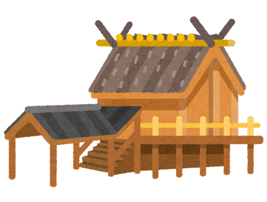
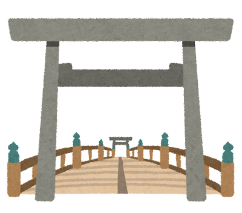

# 伊勢神宮を訪れよう

[伊勢神宮の歴史と文化へ](./page2.md)
[伊勢神宮の魅力へ](./page3.md)

## 目次
1. [伊勢神宮の紹介](#伊勢神宮の紹介)
2. [アクセス情報](#アクセス情報)
3. [写真ギャラリー](#写真ギャラリー)

## 伊勢神宮の紹介
伊勢神宮は、日本の伝統的な神社で、日本人にとって特別な宗教的な場所です。伊勢神宮には内宮（皇大神宮・宇治橋宮）と外宮（豊受大神宮）という2つの主要な神社があります。

内宮（皇大神宮・宇治橋宮）：

内宮は日本の皇室に関連する神聖な神社で、主に天照大神（あまてらすおおみかみ）を祀っています。天照大神は太陽の女神として知られ、日本の皇室の祖先とされています。
内宮は美しい森に囲まれており、伝統的な建築様式で知られています。
外宮（豊受大神宮）：

外宮は豊受大神（とようけおおみかみ）を祀る神社で、豊穣と豊かさをもたらす神として信仰されています。
外宮も美しい景観と伝統的な建築物があり、多くの参拝客に親しまれています。
伊勢神宮は、年間を通じて多くの参拝客や観光客で賑わい、特に正月や神宮祭などの祭事の際には多くの人々が訪れます。伊勢神宮を訪れる際には、特別な服装やマナーが求められることがあるため、事前に情報を確認することが大切です。

伊勢神宮は、日本の歴史や宗教の一部として、文化的な重要性を持つ場所であり、日本の伝統と信仰を感じることができる場所として訪れる価値があります。
## アクセス情報
- 最寄りの駅：[伊勢市駅、五十鈴川駅、宇治山田駅]
- 住所：[〒516-0023 三重県伊勢市宇治館町１]
- アクセス方法：  
[内宮（皇大神宮・宇治橋宮）へのアクセス：
JR参宮線を利用し、伊勢市駅にアクセス。
伊勢市駅から内宮までは徒歩で約10分から15分。]  
[外宮（豊受大神宮）へのアクセス：
近鉄山田線を利用し、鳥羽市内の近鉄鳥羽駅にアクセス。
近鉄鳥羽駅から外宮へのアクセスには、近鉄伊勢志摩ラインに乗り換えることがあり。
徒歩で約10分から15分で外宮に到着。]

## 写真ギャラリー

